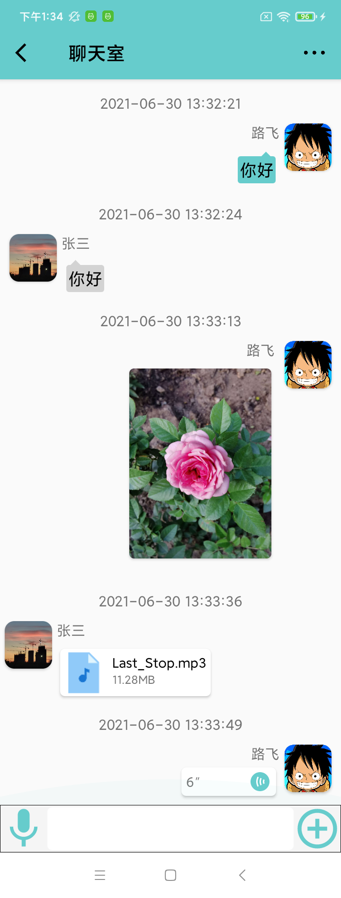

# StarChat
基于WiFi Direct的应急通信软件（安卓版）

## 1 简介
此软件基于WiFi Direct实现在无网络连接情况下两台安卓手机间通信。通信方式包括：文本、图片、文件及语音。如下图所示。



## 2 代码设计
此软件包括两部分。第一部分为创建设备间WiFi Direct连接，使用Android的Wifi P2p框架，然后基于连接的WiFi通道建立Socket连接；第二部分为设备间通信。

### 2.1 设备连接
首先，需要创建广播接收器，以接收设备的状态信息。在MainActivity中接收回调信息，判断设备连接情况进行后续操作。

```java
public class WifiBroadcastReceiver extends BroadcastReceiver{

    @Override
    public void onReceive(Context context, Intent intent) {
      switch (intent.getAction()) {
        ...
        // /用于指示wifi p2p是否可用
        case WifiP2pManager.WIFI_P2P_STATE_CHANGED_ACTION:
        ...
        ...
        //对等节点列表变化
        case WifiP2pManager.WIFI_P2P_PEERS_CHANGED_ACTION:
        ...
        ...
        //wifi p2p连接状态发生变化
        case WifiP2pManager.WIFI_P2P_CONNECTION_CHANGED_ACTION:
        ...
        ...
        //设备信息发生变化
        case WifiP2pManager.WIFI_P2P_THIS_DEVICE_CHANGED_ACTION:
        ...
        }
    }
}
```

然后，在MainActivity中进行设备发现、设备连接、设备断连等操作。

设备发现：
```java
mManager.discoverPeers(mChannel, new WifiP2pManager.ActionListener() {
  ...
}
```
设备连接：
```java
mManager.connect(mChannel, config, new WifiP2pManager.ActionListener() {
  ...
}
```
设备取消连接：
```java
// 当设备处于连接中状态时，可取消连接。
mManager.cancelConnect(mChannel, new WifiP2pManager.ActionListener() {
  ...
}
```
设备断开连接：
```java
// 当设备处于已连接状态时，可断开连接。
 mManager.removeGroup(mChannel, new WifiP2pManager.ActionListener() {
  ...
}
```

设备间建立WiFi Direct连接后，不同的设备会承担不同的角色，包括“Server”和“Client”。与传统的C/S类似。

在建立Socket连接时，“Server”需要开启Service以在后台运行监听socket的程序。“Server”可以在建立WiFi Direct连接后立即bindService。

```java
bindService(intent, mServiceConnection, Context.BIND_AUTO_CREATE);
```

Server在Service中开启线程来监听。
```java
new Thread(() -> {
    try {
        mServerSocket = new ServerSocket(SocketUtil.PORT);
        while (true) {
            Socket socket = mServerSocket.accept();
            Log.d(TAG, "onCreate: " + socket.getInetAddress() + ":" + socket.getPort() + "接入");
            new Thread(new ServerThread(socket)).start();
        }
    } catch (IOException e) {
        e.printStackTrace();
    }

}).start();
```

Client在进入聊天室时连接Server
```java
mClientSocket = new Socket(serverIP, SocketUtil.PORT);
new Thread(new ClientThread(mClientSocket)).start();
```
### 2.2 设备间通信
设备间通信基于Socket。设备根据不同类型的消息（主要是文本类型和文件类型）来进行不同操作。
文本：

```java
//监听输入框的字符串输入变化事件，主要是改变发送按钮和更多功能的显示与隐藏
mInputText.addTextChangedListener(new TextWatcher() {
  ...
});
```
```java
//监听发送按钮的点击事件，获取文本框内容，并发送。
mBnSendMsg.setOnClickListener(v -> {
  ...
}
```

图片：
```java
//打开图库，选择图片
mPhotoImg.setOnClickListener(v -> PictureSelector
        .create(ChatRoomActivity.this, PictureSelector.SELECT_REQUEST_CODE)
        .selectPicture(false));
```

文件:
```java
//打开文件夹，选择文件
mFileImg.setOnClickListener(v -> FilePicker.chooseForMimeType().setTheme(R.style.FilePicker_Elec).setMaxCount(10)
      .setFileTypes("docx", "pptx", "xlsx", "pdf", "zip", "mp3", "mp4")
      .selectFiles(essFiles -> {
          for (EssFile essFile : essFiles) {
            ...
          }
      }).start(ChatRoomActivity.this));
```

语音：
```java
mImgAudio.setOnClickListener(v -> {
...
AudioRecordManager.getInstance(ChatRoomActivity.this).setAudioSavePath(mAudioDir.getAbsolutePath());
...
}
```

# Gradle主要dependencies
```
dependencies {
  ...
  // ConstraintLayout布局
  implementation 'androidx.constraintlayout:constraintlayout:2.0.4'
  // RecyclerView列表组件
  implementation 'androidx.recyclerview:recyclerview:1.2.1'
  // Gson:Json与字符串转换
  implementation 'com.google.code.gson:gson:2.8.6'
  // 图片选择器
  implementation 'com.github.wildma:PictureSelector:2.1.0'
  // 文件选择器
  implementation 'com.github.fengxiaocan:FilePicker:1.0.6'
  // CardView 卡片组件
  implementation 'androidx.cardview:cardview:1.0.0'
  // 图片展示
  implementation "com.github.bumptech.glide:glide:4.12.0"
  // 图片压缩
  implementation 'top.zibin:Luban:1.1.8'
  // 权限处理
  implementation 'com.yanzhenjie:permission:2.0.0-rc3'
}
```
